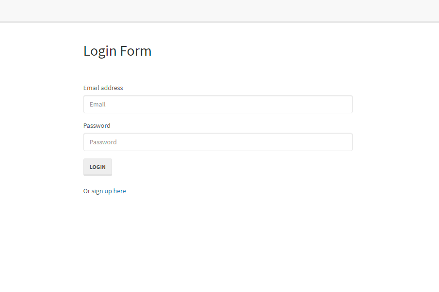

# Authenticator and login Tutorial  
  
  
  
  
  
  
  

  

  [Link to webpage](https://docs.google.com/document/d/1KiVrEEBEW-hioPD9DHIwIJMVIwNMPEWA_K_5oaXaVTc/edit?usp=sharing)
  
  As a developer, I want a walkthrough of the codebase, so that i can use it as a starting point for a new project  
    
  ## Table of Content
  [-Installation](#Installation)  
  [-Description](#Description)    
  [-Usage](#Usage)   
  [-Questions](#Questions)  
  
  
  ## Installation  
When using this app, clone this repository into your local storage. Once this is complete, please follow these steps;
- Create a mysql database by coping this: 
”DROP DATABASE IF EXISTS passport_demo;
CREATE DATABASE passport_demo;” into the mysql schema.  
- Go into the config file, open config.js and insert your username and password in the development object. 
- Open terminal in the /Deploy folder and run "npm i" to install all node packages 
- While in terminal, run "node server.js" and you will successfully connect to server
- In the terminal you can see the link to webpage, otherwise open a browser and enter http://localhost:8080

## Description  
  By reverse engineering this code and write a tutorial (linked to above). I am able to use my "google fu" to my best of abilities to dissect this code and try to the best of my abilities to write a step by step tutorial.

  ## Usage 
  This is an exercise to increase my knowledge by dissecting others code with assistance from instructors or a team.

  
  ## Questions?  
  
    My Github link is [Nvrtis](https://github.com/Nvrtis)
    Any futher questions can be sent to my email here  <Nvav91@gmail.com>

  
 
  
  